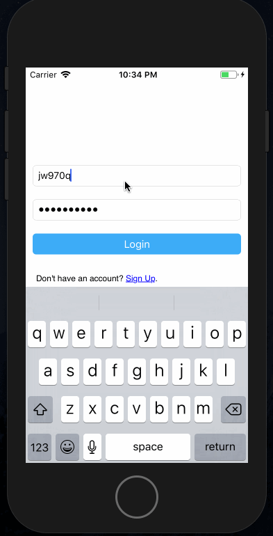

# Pre-work - *OnTheMap*

**OnTheMap** is a map application for iOS.

Submitted by: **Cesar Whatley**

Time spent: **20** hours spent in total

## User Stories

The following **required** functionality is complete:

* [x] The app has a login view that accepts email and password strings from users, with a “Login” button.
* [x] The app downloads the 100 most recent locations posted by students.
* [x] The struct has an init() method that accepts a dictionary as an argument, or the struct conforms to the Codable protocol.
* [x] The app gracefully handles a failure to download student locations.
* [x] The table is sorted in order of most recent to oldest update.
* [x] The app allows users to add a URL to be included with their location.
* [x] 
The app provides a readily accessible "Submit" button that the user can tap to post the information to the server.
* [x] An activity indicator is displayed during geocoding, and returns to normal state on completion.
* [x] The app shows a placemark on a map via the geocoded response. The app zooms the map into an appropriate region.

The following **additional** features are implemented:

- [ ] List anything else that you can get done to improve the app functionality!

## Video Walkthrough 

Here's a walkthrough of implemented user stories:

GIF created with [LiceCap](http://www.cockos.com/licecap/).

## Notes

Had a few issues with setting the region on the map when user tries to add new location.

## License

    Copyright [yyyy] [name of copyright owner]

    Licensed under the Apache License, Version 2.0 (the "License");
    you may not use this file except in compliance with the License.
    You may obtain a copy of the License at

        http://www.apache.org/licenses/LICENSE-2.0

    Unless required by applicable law or agreed to in writing, software
    distributed under the License is distributed on an "AS IS" BASIS,
    WITHOUT WARRANTIES OR CONDITIONS OF ANY KIND, either express or implied.
    See the License for the specific language governing permissions and
    limitations under the License.